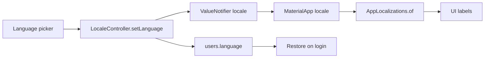

# إكمال الترجمة العربية والإنجليزية

## الوضع الحالي (ما بدأتموه — نكمله ولا نعيده)

النظام جاهز تقنياً ونستخدمه كما هو:

- المكتبات: `flutter_localizations` + `intl` + ملفات ARB + `flutter gen-l10n`
- التبديل: `[lib/locale_controller.dart](lib/locale_controller.dart)` عبر `ValueNotifier` مربوط في `[lib/main.dart](lib/main.dart)` (`locale` + `localizationsDelegates` + `supportedLocales`)
- الملفات: `[lib/l10n/app_en.arb](lib/l10n/app_en.arb)` (القالب) + `app_ar.arb` + `app_fr.arb`
- اللغات المدعومة في الكود: `en` / `ar` / `fr`
- الحفظ في Firestore: `users/{uid}.language` بالقيم `English` / `Arabic` / `French`

ما لم يكتمل بعد:

- يوجد **29 مفتاحاً** متطابقاً في en/ar/fr وكلها لعناوين الملف الشخصي، و**لا شاشة تستدعي** `AppLocalizations.of(context)` حتى الآن (حتى `[profile_screen.dart](lib/screens/profile_screen.dart)` ما زال نصوصاً ثابتة)
- زر اللغة في دروجر الهوم غير مربوط (تعليق: «منربط تبديل اللغة فعليًا بالخطوة الجاية»)
- بعد إعادة فتح التطبيق اللغة تعود لإنجليزي لأن `LocaleController` يبدأ دائماً بـ `Locale('en')` ولا يُستدعى `setLanguage` عند تحميل الملف الشخصي
- نحو **740 نص واجهة ثابت** عبر 27 شاشة، منها نحو 108 رسائل تحقق نماذج — كلها إنجليزية
- الإشعارات تُعرض كما هي مخزّنة في Firestore (`title` / `message` وليس `body`) بلغة واحدة؛ التطبيق لا ينشئ الإشعارات
- بنرات الهوم الأربعة فيها **نص إنجليزي داخل الصورة** ولا يوجد تبديل حسب اللغة

الفرنسية تبقى في الملفات لأن `gen-l10n` يفرض وجود كل مفتاح في كل ملف ARB، ولأن منتقي اللغة الحالي يعرضها. التركيز الوظيفي لكم: عربي + إنجليزي.




---

## قواعد ثابتة لا نكسرها أثناء الإكمال

- لا مكتبات ترجمة جديدة، لا نظام l10n ثانٍ، لا ملفات `*_new.dart`
- كل نص واجهة ثابت يدخل ARB ثم يُستدعى بـ `AppLocalizations.of(context)!`
- **لا تُترجم** أسماء العملاء، أرقام التتبع، المعرّفات، الهواتف، الإيميلات، الأسعار، مسارات التخزين
- قيم الحالة في Firestore تبقى كما هي (`in_transit`, `delivered`, …) — نترجم **عرضها فقط**
- أنواع الخدمة المخزّنة (`Sea Freight` …) تبقى كما هي عند الإرسال لـ Firestore — نترجم البطاقة/العنوان فقط
- الفلاتر والمقارنات تتم على القيمة الخام وليس على النص المعروض (مهم جداً في `[my_support_requests_screen.dart](lib/screens/my_support_requests_screen.dart)` حيث المقارنة حالياً مع `'New'` بعد `_displayStatus`)
- العربية RTL تلقائياً عبر `locale: Locale('ar')` + delegates الحالية؛ نصلح فقط `Alignment.centerLeft` / `TextAlign.left` حيث تكسر الاتجاه إلى `AlignmentDirectional` / `TextAlign.start`
- بعد كل دفعة مفاتيح: إضافة المفتاح في `app_en.arb` ثم نفس المفتاح في `app_ar.arb` و`app_fr.arb` ثم `flutter gen-l10n`

طريقة الاستبدال داخل الشاشات (نفس النمط في كل الملفات):

```dart
final l10n = AppLocalizations.of(context)!;
Text(l10n.quickActions)
```

نصوص فيها رقم تتبع أو اسم:

```json
"shipmentInTransitMessage": "Shipment {trackingNumber} is in transit."
```

---

## المرحلة 0 — إصلاح ما بدأ (قبل ترجمة الشاشات)

هذا يجعل التبديل الحالي يعمل بشكل صحيح بعد الإغلاق وإعادة الفتح.

1. عند تسجيل الدخول / فتح الهوم / تحميل الملف الشخصي: قراءة `users.language` واستدعاء `LocaleController.setLanguage` (اليوم يُحفظ الاختيار ولا يُطبَّق عند الإقلاع).
2. ربط زر اللغة في دروجر `[home_screen.dart](lib/screens/home_screen.dart)` (حوالي السطر 1021) بنفس الـ bottom sheet الموجود في الملف الشخصي، وتحديث شارة `EN` / `AR` حسب `LocaleController.locale`.
3. ربط مفاتيح ARB التسعة والعشرين الموجودة فعلياً في `[profile_screen.dart](lib/screens/profile_screen.dart)` عبر `AppLocalizations.of`.
4. الإبقاء على قيم Firestore `English`/`Arabic`/`French` كما هي (متوافقة مع `setLanguage`).

ما يلزمكم هنا: لا شيء من طرفكم إلا تأكيد أن حقل `language` موجود عند المستخدمين الحاليين (الافتراضي `English`).

---

## المرحلة 1 — مفاتيح مشتركة (تُكتب مرة وتُستخدم في كل الشاشات)

تُضاف أولاً في ARB ثم تُستبدل في الشاشات:

- أزرار: Cancel, Update, Done, Try again, Sign out, Delete, Confirm, Save, Next, Submit
- حالات عامة: loading, empty, error, noConnection
- رسائل أخطاء الشبكة والنماذج المتكررة (نحو 108 رسالة validator فريدة تُوحَّد قدر الإمكان قبل إدخالها في ARB)
- حالات الشحن للعرض فقط: Pending, Confirmed, Prepared, In Transit, Customs, Out for Delivery, Delivered, Cancelled
- مراحل التايملاين (العناوين + الوصف) في `[shipments_screen.dart](lib/screens/shipments_screen.dart)` و`[shipment_details_screen.dart](lib/screens/shipment_details_screen.dart)` و`[track_shipment_screen.dart](lib/screens/track_shipment_screen.dart)`
- أسماء الخدمات للعرض: Sea Freight, Air Freight, Land Freight, Car Shipping, International Moving, Parcel Shipping

---

## المرحلة 2 — ترجمة الشاشات شاشة بشاشة

ترتيب التنفيذ (الأكثر ظهوراً أولاً). في كل شاشة: جرد النصوص الثابتة → مفاتيح ARB → استبدال → التحقق من RTL.


| الترتيب | الملف                                                                                                                                                                                                                                                                                                                                                                                | ماذا يُترجم                                                                 |
| ------- | ------------------------------------------------------------------------------------------------------------------------------------------------------------------------------------------------------------------------------------------------------------------------------------------------------------------------------------------------------------------------------------ | --------------------------------------------------------------------------- |
| 1       | `[login_screen.dart](lib/screens/login_screen.dart)` / `[register_screen.dart](lib/screens/register_screen.dart)` / `[forgot_password_screen.dart](lib/screens/forgot_password_screen.dart)`                                                                                                                                                                                         | عناوين، تلميحات، تحقق النماذج، أخطاء Firebase                               |
| 2       | `[home_screen.dart](lib/screens/home_screen.dart)`                                                                                                                                                                                                                                                                                                                                   | Quick Actions، الخدمات، الدروجر، البوتوم بار، SnackBars                     |
| 3       | `[profile_screen.dart](lib/screens/profile_screen.dart)`                                                                                                                                                                                                                                                                                                                             | بقية الحوارات: كلمة المرور، حذف الحساب، تسجيل الخروج، الأخطاء               |
| 4       | `[shipments_screen.dart](lib/screens/shipments_screen.dart)` / `[shipment_details_screen.dart](lib/screens/shipment_details_screen.dart)` / `[track_shipment_screen.dart](lib/screens/track_shipment_screen.dart)`                                                                                                                                                                   | فلاتر، حالات، تايملاين، أزرار                                               |
| 5       | `[my_quotes_screen.dart](lib/screens/my_quotes_screen.dart)` / `[get_quote_screen.dart](lib/screens/get_quote_screen.dart)` / `[request_quote_screen.dart](lib/screens/request_quote_screen.dart)`                                                                                                                                                                                   | النماذج والعروض                                                             |
| 6       | `[create_booking_screen.dart](lib/screens/create_booking_screen.dart)` / `[my_bookings_screen.dart](lib/screens/my_bookings_screen.dart)`                                                                                                                                                                                                                                            | الحجوزات                                                                    |
| 7       | شاشات الخدمات الست                                                                                                                                                                                                                                                                                                                                                                   | العناوين، النماذج، DONE، رسائل الإرسال                                      |
| 8       | `[notifications_screen.dart](lib/screens/notifications_screen.dart)`                                                                                                                                                                                                                                                                                                                 | واجهة الشاشة + مجموعات Today/Yesterday/Earlier (محتوى الإشعار في المرحلة 4) |
| 9       | `[shipping_documents_screen.dart](lib/screens/shipping_documents_screen.dart)` / `[support_screen.dart](lib/screens/support_screen.dart)` / `[my_support_requests_screen.dart](lib/screens/my_support_requests_screen.dart)` / `[volume_calculator_screen.dart](lib/screens/volume_calculator_screen.dart)` / `[shipment_request_page.dart](lib/screens/shipment_request_page.dart)` | الباقي التشغيلي                                                             |
| 10      | `[privacy_policy_screen.dart](lib/screens/privacy_policy_screen.dart)` / `[terms_conditions_screen.dart](lib/screens/terms_conditions_screen.dart)`                                                                                                                                                                                                                                  | النصوص القانونية الطويلة كمفاتيح ARB متعددة الفقرات                         |


ما يلزمكم في هذه المرحلة: مراجعة صياغة العربية القانونية (سياسة الخصوصية والشروط) إن رغبتم بنص رسمي معتمد بدل ترجمة مباشرة.

---

## المرحلة 3 — الصور حسب اللغة (الاقتراح)

البنرات الحالية فيها نص داخل الصورة:

- `banner.png` → Door To Door Services
- `banner 2.png` → Sea Freight Solutions
- `banner 3.png` → Car Shipping Made Simple
- `banner 4.png` → International Moving Made Easy

صور الخدمات والشعار:

- مشتركة بلا تبديل: `sea_freight.png`, `car_shipping.png`, `moving.png` (صور بلا نص تطبيق)
- مشتركة رغم وجود علامة تجارية لطرف ثالث داخل الصورة: `air_freight.png` (Lufthansa), `land_freight.png` (MAN/Krone) — لا نترجم علامات الغير
- الشعار `tawam_logo.png` وأيقونة التطبيق يبقيان باللاتينية كهوية تجارية (نسخة عربية اختيارية لاحقاً إن رغبتم)
- `parcel.png` فيها كلمة **PARCEL SHIPPING** داخل الصورة: نسخة عربية اختيارية؛ الأولوية للبنرات الأربعة
- عناوين بطاقات الخدمات وشاشات الخدمات مكتوبة كـ `Text` فوق الصورة وليست داخل الملف — تُترجم عبر ARB في المرحلة 2، لا عبر تبديل الصورة

**الطريقة المقترحة (بدون مكتبات جديدة):** مجلد لكل لغة + مسار من `LocaleController`:

```
assets/images/banners/en/banner_1.png
assets/images/banners/en/banner_2.png
assets/images/banners/en/banner_3.png
assets/images/banners/en/banner_4.png
assets/images/banners/ar/banner_1.png
...
assets/images/banners/fr/banner_1.png   (اختياري؛ إن غاب نرجع لـ en)
```

دالة صغيرة داخل `[locale_controller.dart](lib/locale_controller.dart)` (بدون ملف جديد):

```dart
static String bannerAsset(String fileName) {
  final code = locale.value.languageCode; // ar | en | fr
  return 'assets/images/banners/$code/$fileName';
}
```

`[home_screen.dart](lib/screens/home_screen.dart)` يبني قائمة البنرات من هذه الدالة بدل المسارات الثابتة، فيتحدث السلايدر فوراً مع `ValueListenableBuilder` الموجود أصلاً في `MaterialApp`.

تسجيل المجلدات في `pubspec.yaml`:

```yaml
assets:
  - assets/images/
  - assets/images/banners/en/
  - assets/images/banners/ar/
  - assets/images/banners/fr/
```

للعربي: نسخة بالنص العربي، ويفضّل عكس التكوين (النص يمين / الصورة يسار) ليتوافق مع RTL.

بديل أطول أمداً (اختياري لاحقاً): صورة بلا نص + `Text` مترجم فوقها. لا نفعله الآن حتى لا نعيد تصميم البنرات.

**ما يلزمكم تجهيزه:** 4 ملفات PNG عربية بنفس المقاس الحالي للبنرات (ونسخ فرنسية إن أردتم الإبقاء على الفرنسية بصرياً). الإنجليزية = نقل الملفات الحالية إلى `banners/en/`. نسخة عربية لـ `parcel.png` اختيارية وليست شرطاً لإنهاء الترجمة.

---

## المرحلة 4 — ترجمة الإشعارات تلقائياً

التطبيق **لا ينشئ** مستندات `notifications`؛ يقرأها فقط. الحقول الحالية: `title`, `message`, `type` (`quote` / `support` / غير ذلك → Shipment), `referenceId`, `isRead`, `createdAt`.

لا نترجم النص المخزّن بترجمة آلية خارجية، ولا نحذف `title`/`message` حتى تبقى الإشعارات القديمة ظاهرة.

**داخل التطبيق (تلقائي عند تبديل اللغة):**

1. إضافة حقل اختياري جديد دون إعادة تسمية الحقول القديمة:
  - `event` مثل `shipment_in_transit` / `quote_ready` / `support_reply`
  - `params` مثل `{ "trackingNumber": "TW-123" }`
2. مفاتيح ARB مع placeholders:

```json
"notifShipmentInTransitTitle": "Shipment update",
"notifShipmentInTransitBody": "Shipment {trackingNumber} is now in transit."
```

1. في `[notifications_screen.dart](lib/screens/notifications_screen.dart)`: إذا وُجد `event` معروف → اعرض الترجمة حسب اللغة الحالية؛ وإلا → اعرض `title`/`message` كما هما (توافق مع الإشعارات القديمة).
2. `type` يبقى للفلاتر والأيقونات، لا يُستبدل.

**إشعارات الدفع FCM (التطبيق بالخلفية):** النظام لا يترجم `notification.title` بعد وصوله. المصدر الذي يرسل FCM يجب أن يقرأ `users.language` الموجود أصلاً ويرسل العنوان/النص باللغة المحفوظة. نفس مفاتيح `event` تُستخدم لتوليد النص.

**ما يلزمكم من لوحة الإدارة / Functions (خارج هذا الريبو):**

- عند إنشاء إشعار جديد: كتابة `event` + `params` بالإضافة إلى `title`/`message` الإنجليزية كاحتياط
- عند إرسال FCM: اختيار النص حسب `users.language` (`English`/`Arabic`/`French`)
- عدم تغيير قيم `type` الحالية

إن تعذّر تعديل الباكند فوراً: التطبيق يترجم واجهة شاشة الإشعارات فقط، والمحتوى القديم يبقى كما خُزّن إلى أن تُضاف `event`.

ملاحظة: حقل `users.notificationsEnabled` يُحفظ من الملف الشخصي ولا يُقرأ حالياً عند إرسال FCM — هذا خارج نطاق الترجمة ولا نغيّره في هذه الخطة. FCM حالياً يحفظ التوكن فقط ولا يعرض إشعاراً داخل التطبيق وهو مفتوح؛ ترجمة نص الدفع تبقى على جهة الإرسال.

---

## المرحلة 5 — ضبط RTL والجودة

- استبدال المحاذاة اليسرى الثابتة بـ `AlignmentDirectional` / `EdgeInsetsDirectional` في الهيدر والدروجر والنماذج عند ظهور كسر بالعربي
- أزرار الرجوع المخصصة تبقى تعمل لأن أيقونات Material تدعم `matchTextDirection`
- التواريخ النسبية (Today / 2h ago) تُترجم؛ الأرقام وأرقام التتبع بلا تغيير
- `flutter gen-l10n` ثم `dart format` على الملفات المعدّلة ثم `flutter analyze` على ما تغيّر فقط
- اختبار يدوي: تبديل اللغة من الملف الشخصي ومن الهوم دون إعادة تشغيل؛ إغلاق التطبيق وإعادة الدخول؛ شاشة فيها شحنة بحالة `in_transit`؛ إشعار قديم بدون `event` وإشعار جديد مع `event`؛ البنرات الأربعة بالعربي والإنجليزي

---

## قائمة ما تحتاجونه أنتم (غير البرمجة)

1. تجهيز 4 بنرات عربية (ونسخ FR إن رغبتم)
2. اعتماد نص سياسة الخصوصية والشروط بالعربي إن لزم نص قانوني رسمي
3. في مصدر الإشعارات (لوحة/Functions): إضافة `event` + `params`، وإرسال FCM حسب `users.language`
4. المرور على التطبيق بعد كل مرحلة والتأكيد على الصياغة العربية

## ما لن نفعله

- لن نبدأ نظام ترجمة جديد
- لن نغيّر أسماء مجموعات Firestore ولا قيم الحالات المخزّنة
- لن نضيف Google Translate أو أي API ترجمة
- لن نخفي الفرنسية من المنتقي الحالي

